## Problem:
Weak material leads to cracking and splitting of the water channels. An extreme example below, with a smaller split also beginning to form in the corner behind it.
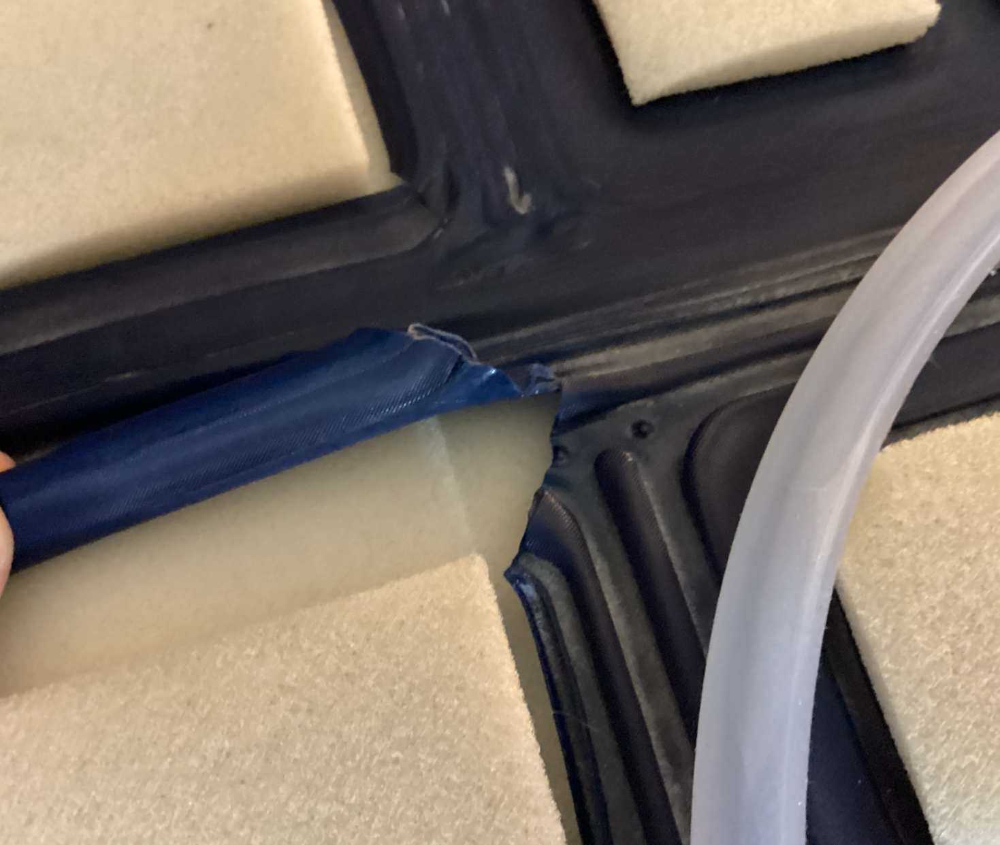

## Patching
About 2 years ago, my friend's eightsleep mattress topper started leaking. They had good luck with waterproof gorilla tape, and were able to reach inside the mattress topper and wrap the leaking area with tape. I tried patching the leak initially, using the same product. This didn't work for me. I got one extra night's sleep before the leak reappeared.

Patch Tape:
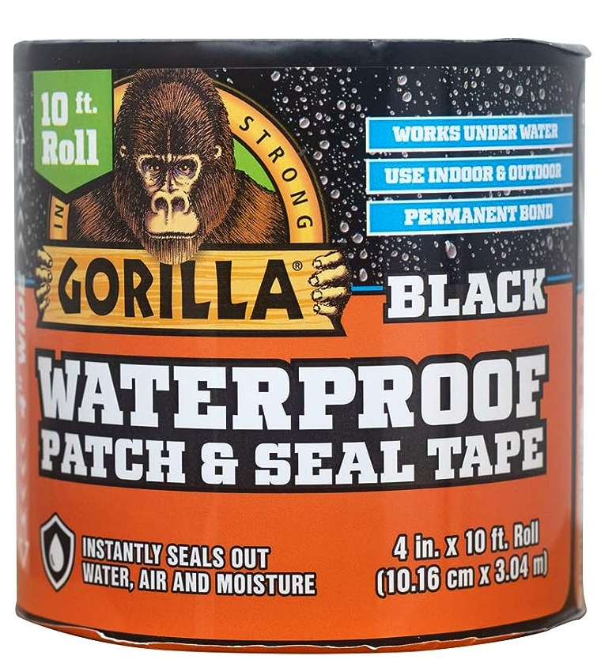

My patch:
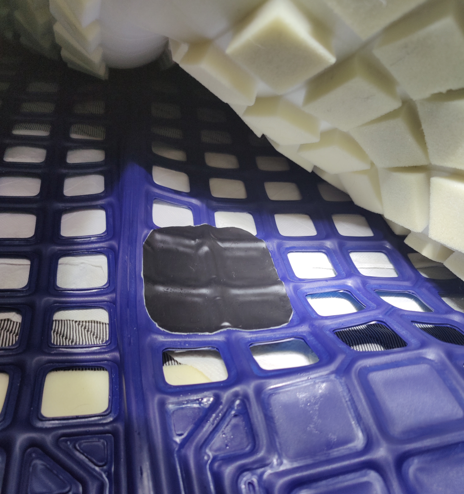

So this approach didn't work for me. However my friend's patch is reportedly holding strong with no further issues, over 2 years later. YMMV.

## The extreme option:

Materials and tools:
- [Plastic Reducer Fittings - 3/8" to 1/4" - 4 pcs](https://www.amazon.ca/dp/B099RVBQC6)
- [Plastic Union - 1/4" to 1/4" - 2 pcs](https://www.amazon.ca/dp/B099ZVH6VP)
- [Cable Tie Tensioning Gun](https://www.amazon.ca/dp/B08FR639VX)
- [Silicone Tubing 26.25ft - 4 lengths](https://www.amazon.ca/dp/B08FJ9TTQV)
- Xacto Knife or similar

The plan: to replace the leak-prone grid system with a continuous loop of silicone tubing.

I couldn't find a cheap and easy supply of silicone tube in the lengths I needed. I estimated about 100ft of hose per side of our cali-king if I wanted to match the original grid dimensions. 

I'd much rather make each side of the mattress out of one uninterrupted piece of tube to virtually eliminate chances of leaking. 
To keep things simple and keep the project moving, I decided to join 2 lengths of hose per side of the bed, with a union near the knees/calves where it hopefully wouldn't be easily felt.

All of the factory connections are barbed connectors and tubing held with zip ties for compression.

### Disassembly:

Cutting the perimeter stitching:
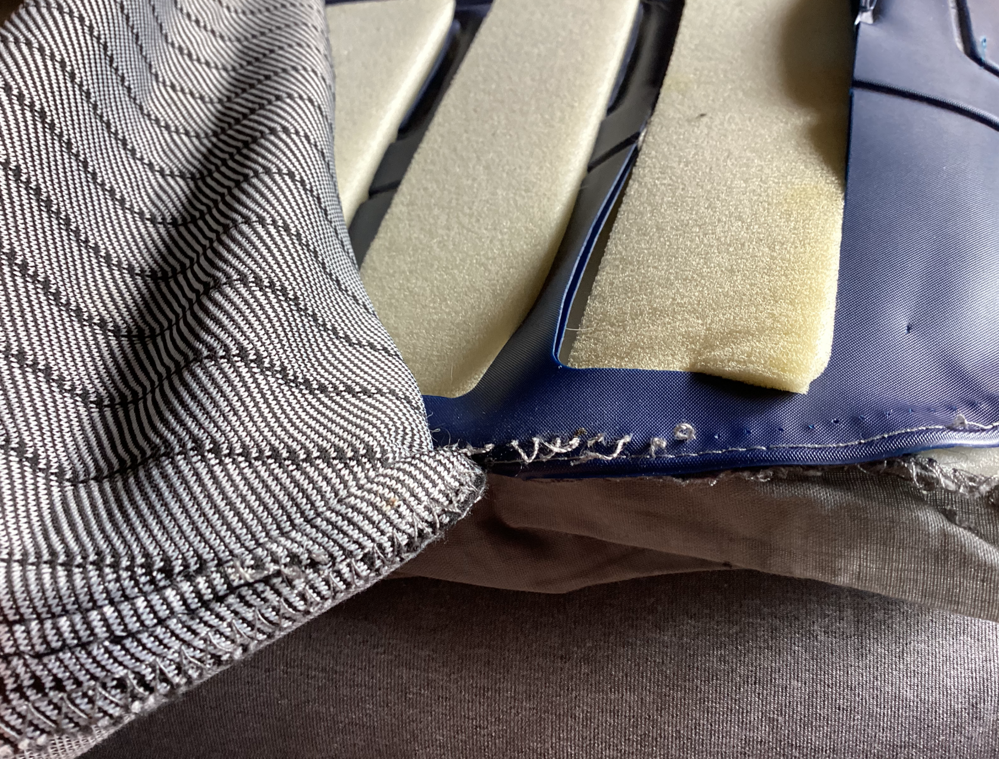
Slow process. Used a super sharp blade and a steady hand. You can get into a rhythm, pulling the upper fabric away and gently cutting the threads as they pull taut. 
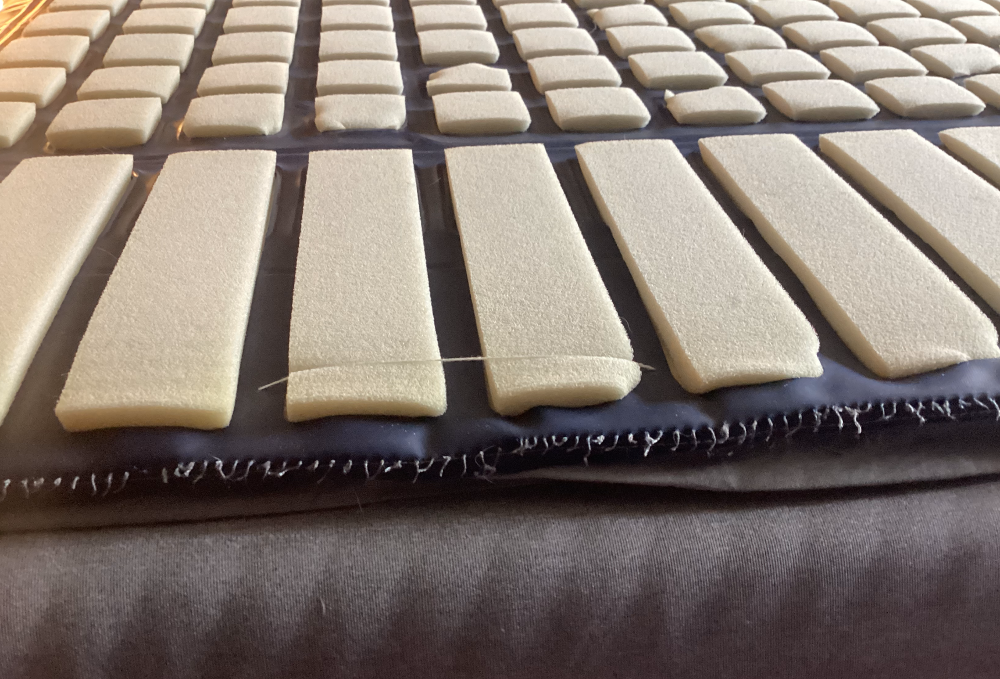

Closeup of the factory grid:
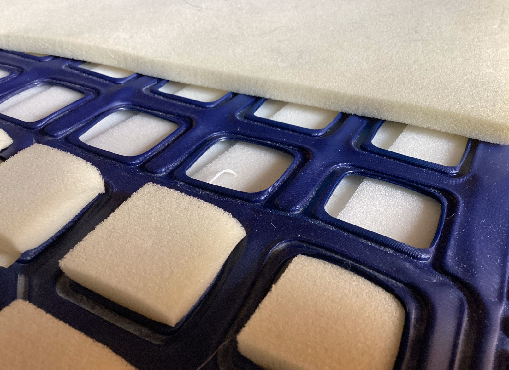

Layers of the topper:
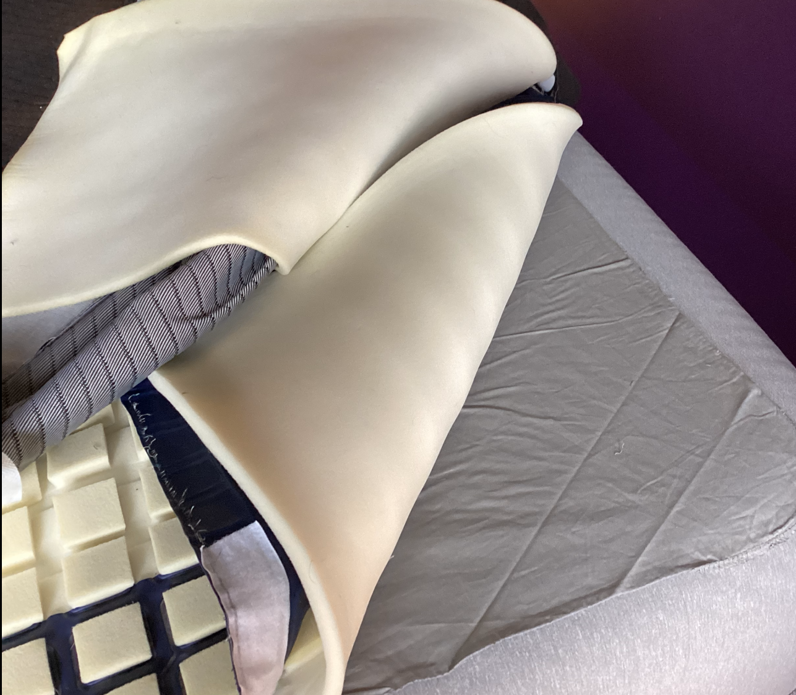
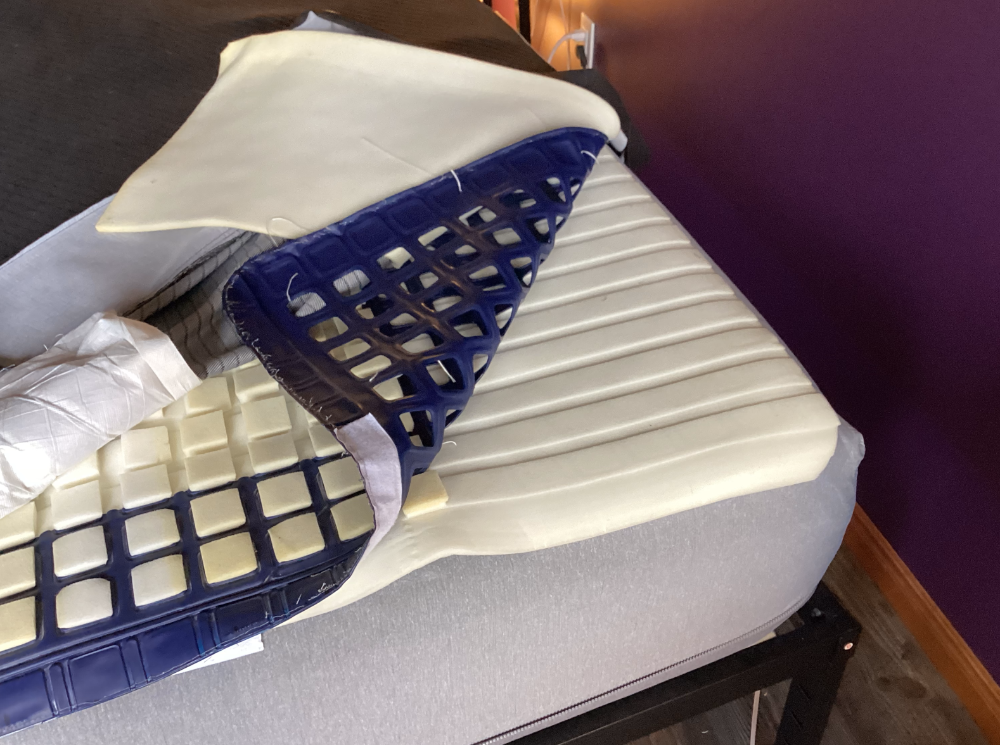

### Switching to Silicone:

I measured the ends of the black factory supply and return hoses at 3/8" ID, so ordered reducers from 3/8" to 1/4" to reduce the size of the hose running through the mattress.

Initial test of the reducer fittings. Bypassing the original factory grid system:
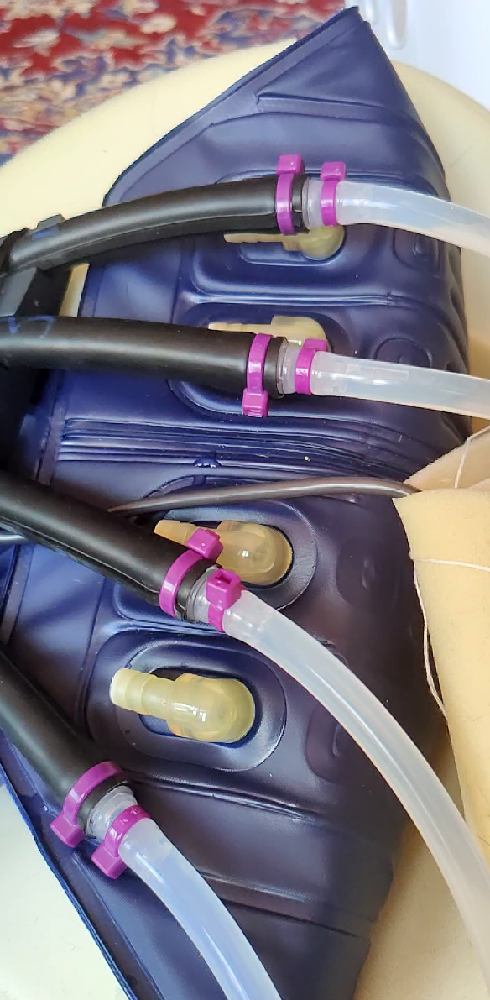
No leaks! Watching the water being pumped into the new hoses for the first time was a pretty exciting moment.

Test layout with short torso-length tubes:
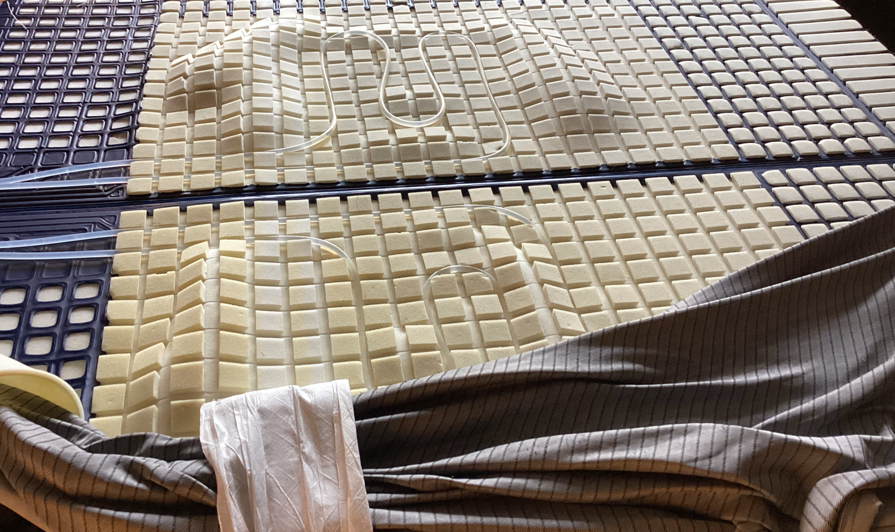
This test layout was done with a single 26ft length of tube, cut in half. There was only enough tube for a couple of loops/rows that lay under your lower back. I zipped the cover back down over top and we slept on this for a few days. This confirmed that there were zero leaks, and we could definitely feel the cooling effect at work. 

The factory grid covered the entire mattress. To improve comfort with the silicone hose, I carved out the majority of the grid and routed the tubes through the channels in the foam. 

I left extra grid material toward the foot end to test whether or not it made a noticeable difference in comfort when combined with the tubing. 

I also left a perimeter of the grid material all around the mattress. The supply/return lines hang off the grid material at the head end of the bed. I was concerned that the heavy weight of the water in the supply lines would pull on the connectors if it wasn't properly supported by the grid. I feel like I could have cut even more of the grid away without sacrificing its strength for holding the supply lines.

#### Joining 2 lengths of hose for each side of the bed:
The 1/4" plastic unions:
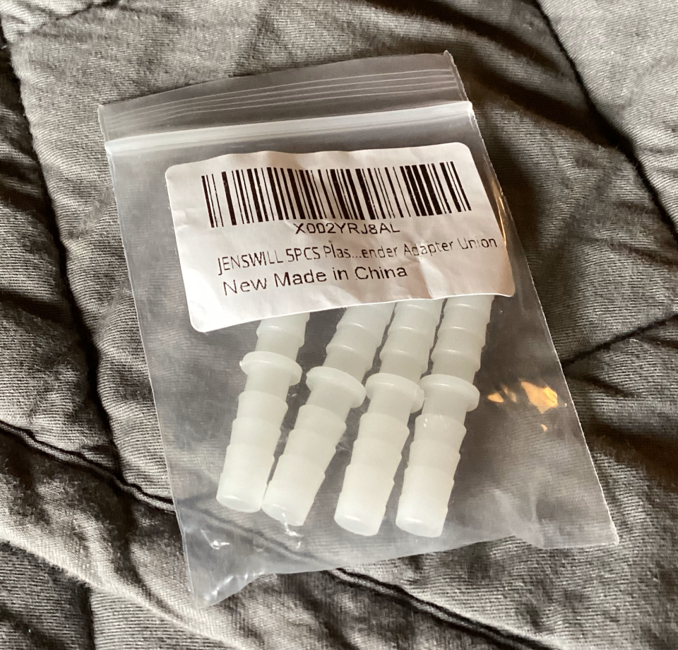

Joining 2 sections of tube:
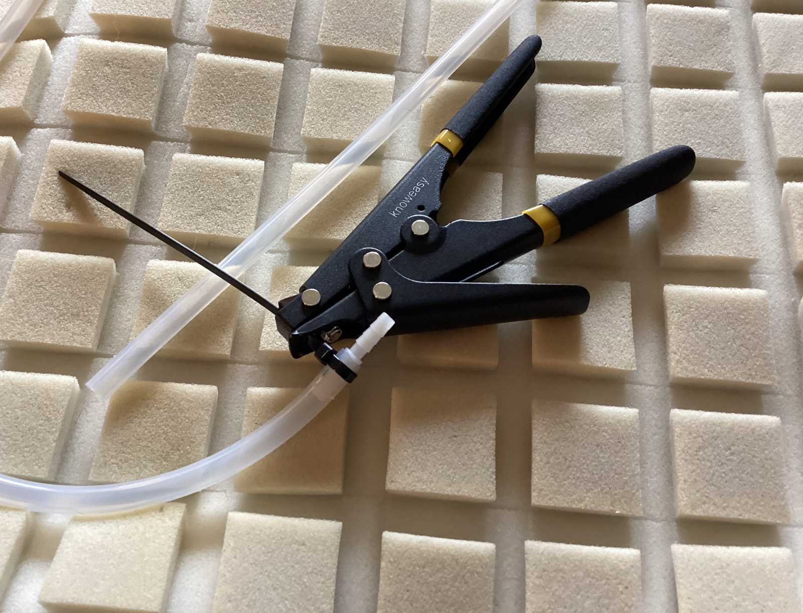
I should have bought one of these zip-tie guns years ago. Quite handy, and was able to apply more tension than I could have done by hand. It also cuts the excess off while under tension, so there are no sharp plastic edges that can be felt.

Close up of one side of the joint. Good amount of pressure being applied by the zip tie. 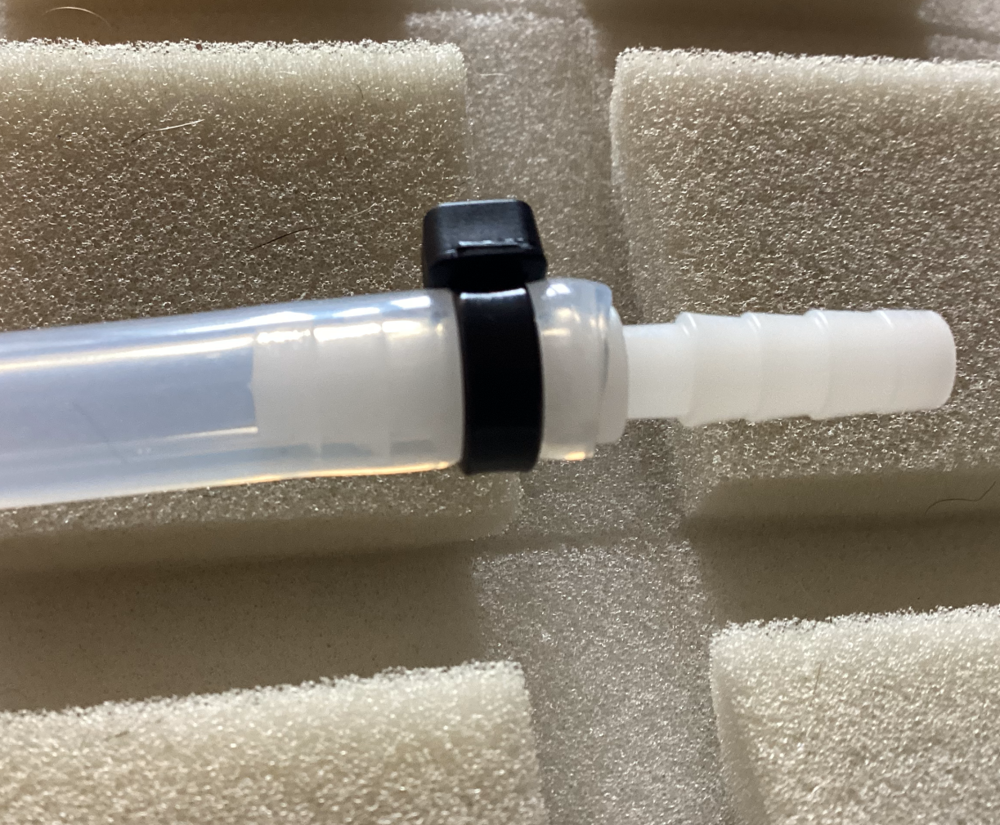

I was concerned about having this connector buried in the middle of the mattress area. Instinctively this feels like it's going to be too fragile.

After joining the 2 segments, I did some informal testing by squashing the fitting under my knees and elbows into the mattress. The foam of the mattress allows the hose and fitting to sink in, and it barely seems to strain the connector. I was honestly expecting to break the fitting in that test, so that was a pleasant surprise.

I also wanted to make sure the hose wouldn't slip off the connector. So I stood on one side of the hose, and pulled the other side hard enough to stretch the silicone tubing. The tubing stretched but the connector didn't budge. I can't imagine this kind of force happening when it's installed in the mattress, so this seems like a safe option.

This was the layout I settled on before zipping the top cover over everything. 2 x 26.25' lengths of hose per side of the bed:

I tried to place the union for the 2 hoses under my upper calves. This seemed like a good idea at the time, and still does. I haven't noticed the connector at all while sleeping on it.

As a result of wanting to place the connector at knee height, I got creative with the hose routing as well. Using the factory grid system, the area behind the knees/calves is routed every row, while the area for the torso is routed every 2nd row. 

Note: I was surprised at how nice this is. Having stronger cooling on my legs doesn't feel as jarring as a uniformly cold mattress can.

In hindsight, I should have removed even more of the grid down to the foot end of the bed. Having the tubes overlap with the grid makes the silicone tube much more noticeable and a little uncomfortable under your calves.

I happened to have a weighted blanket handy, which was very helpful to keep things from shifting around too much as I worked around the mattress.
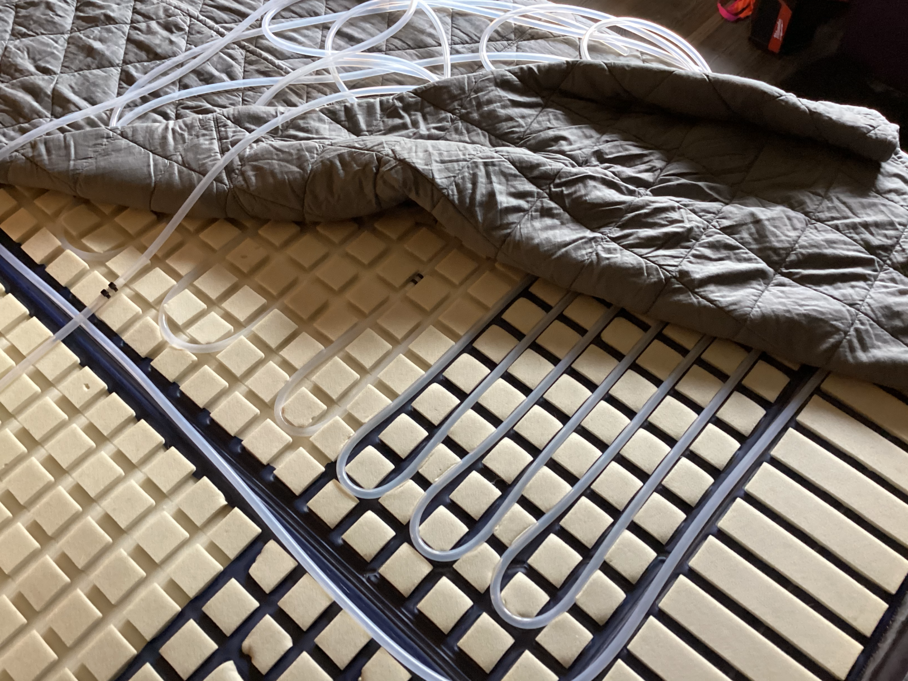

Tube routing from the head end:
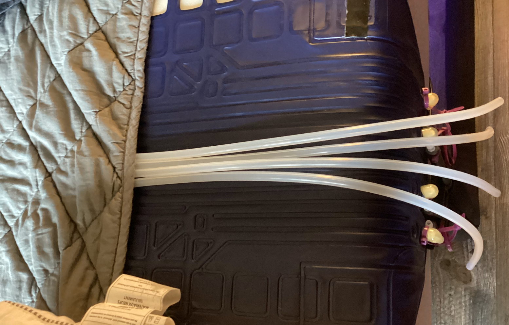

Factory 90 degree connectors are yellowed, pointing downward. 
Replaced with 3/8" to 1/4" straight-through adapters, already installed below:
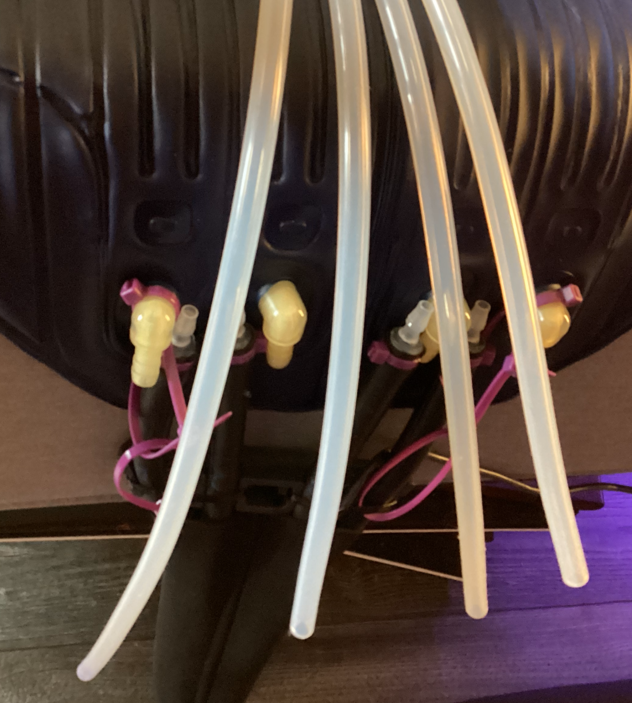
The inner 2 hoses are the supply lines for their respective sides of the bed. The outer two hoses are the return lines for their respective sides.

The extra loops of purple zip ties in the photo above are being used to suspend the factory supply tube assembly at its original height.  

Most noticeable visual change:
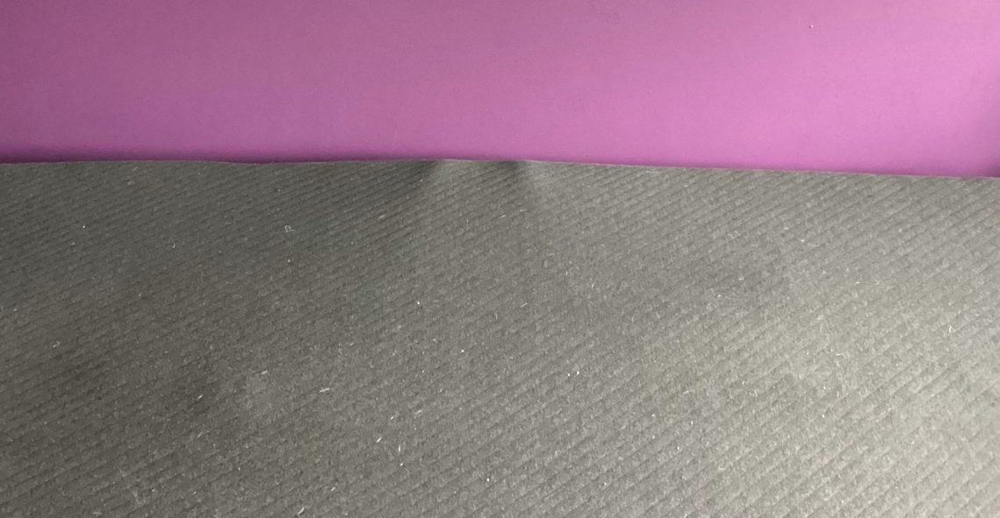

## Verdict
End result: Pretty good! The most noticeable part is covered by your pillows. There is a noticeable ridge down the centerline of the bed, where 2 to 4 lines converge. Removing the center strip of the grid material from the mattress will likely help this a lot.

At this point, nothing has been stitched back together. The new tubes are just held in place by gravity and rest in their foam channels. 1 month later and they haven't even shifted from their original placement. There is a non-zero chance that this "temporary" arrangement of mine will become permanent. I have the original type of mattress encasement provided by eightsleep, which provides a zipper attachment all around the mattress. This zipper has been enough to hold the top fabric firmly and prevent anything from moving.

When I'm ready to make this solution permanent, I intend to stitch small loops of thread around the silicone tube throughout the mattress, tying it to foam topper more permanently. I'll likely need to add fabric behind the foam to prevent the threads from cutting through the soft foam over time. I think the stitching will need to be somewhat loose so that the silicone tube is able to shift slightly as people move.

When all is said and done, I can then stitch the outer perimeter of the topper back together and will hopefully have a complete mattress topper.

### Notes/findings:
- The eightsleep hub has no monitoring of the water flow outside of the hub itself. As far as the hardware or software is concerned, nothing has changed.
- I was concerned about the possible water pressure being supplied by the hub. I haven't taken any pressure measurements, but even the internal plumbing fittings within the hub are using barbed connectors + zip ties. The pumps are very small, so I don't believe they can build up enough pressure to pop any of the fittings off.
- I was also concerned that with a single loop design, your body weight could pinch the tubing and completely stop the flow of water. Either stopping the cooling, or in the worst-case, causing pressure to build and pop the fittings loose. I have tried crushing the tubing between my thumb and fingers while the pumps are running, and cannot completely stop the flow of water at a single point. In practice, this doesn't seem to be an issue. Between the soft mattress and foam topper, any firm pressure points are not able to restrict the flow of water in a noticeable way. A thinner walled tube may potentially have this issue however.
- I expected that the direction of water flow would matter more than it does. For example if the cold water flows in from the head toward the feet, I expected my upper body to feel colder, while the water would be slightly warmed by the time it reached my feet. This is probably theoretically true, but in practice the whole loop feels like a uniform temperature while in use.
- At some point I'd like to try using an even thinner tube to improve comfort. Possibly using a Y splitter and running multiple loops per side. However a thinner tube might fold down between the foam grid and become insulated from your body. 

I'm planning to keep this page/thread updated as I learn more. I'd like to turn this into a step by step tutorial or cover the project points in more detail when I have the time.
At the time of writing, it's been 1 month of sleeping on my repaired mattress. The cooling effect has been almost as good as the original. Most importantly: no leaks!
